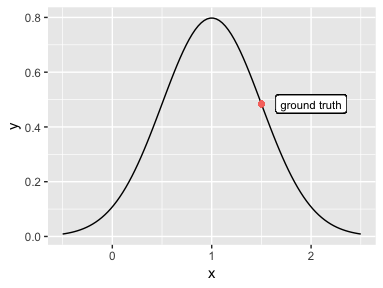
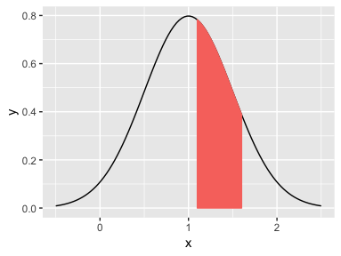

# iregnet on CRAN

## Project Info

**Project title:** iregnet on CRAN

**URL of project idea page:** [https://github.com/rstats-gsoc/gsoc2019/wiki/iregnet-on-CRAN](https://github.com/rstats-gsoc/gsoc2019/wiki/iregnet-on-CRAN)


## Bio of Student

I am Ao Ni, currently a senior student who major in Applied Statistics at Sun Yat-sen University, China. After graduation, I will study for a master's degree in Computer Science at Johns Hopkins University. I code in Python, C++, R and Swift. During my undergraduate years, I have worked on many Computer Science or Statistics related project, including the development of R Package. 

Survival Analysis is one of my favorite course, that's why I am so excited about this project. Beyond Courses, I have researched on ARIC (The Atherosclerosis Risk in Communities Study). This dataset provide detailed medical history data of over ten thousand of participants, which could be transformed into the interval of certain disease (e.g. peripheral arterial disease). I believe iregnet is the perfect tool to handle this kind of datasets. Equiped with strong coding skills and Statistical knowledge, I would love to work on this project and bring iregnet on CRAN.


## Contact Information

**Student name:** Ao Ni

**Student postal address:** Room 302, Building 3, Hupojiawan Residential Zone, Changxing County, Zhejiang Province, China

**Telephone:** +86 155-2138-9969

**Email:** neo.aoni@gmail.com 

**Other communications channels:** live:neolovepineapple (Skype)


## Student Affiliation 

**Institution:** School of Mathematics, Sun Yat-sen University

**Program:** B.S in Applied Statistics

**Stage of completion:** Graduate at June, 2019

**Contact to verify:** 

Haiyan Lin,      
Teaching Secretary at School of Mathematics, Sun Yat-sen University          
email: mcslhy@mail.sysu.edu.cn


## Schedule Conflicts

I will commit my whole summer to GSoC. There will be no other internships or projects during this period.

## Mentors
**Mentor names:**

* Toby Dylan Hocking
* Anuj Khare


**Mentor emails:**

* Toby Dylan Hocking (tdhock5@gmail.com)
* Anuj Khare (khareanuj18@gmail.com)

**Have you been in touch with the mentors? When and how?**


## Coding Plan and Method

### Implement a cross validation method on iregnet

In this section, my goal is to implement a cross-validation function to fit an interval regression (i.e. iregnet) by optimizing the lambda parameter. This function calls iregnet repeatedly according to the number of flods. Then a set of validation errors are calculated corresponding to a list of lambda values, which were either manually specified or generated by algorithm. The best lambda will be choosen based on different criterion.

#### Method

This part focus on the theoratical aspect of the implementation. The keys when select the best lambda value by cross validation are error functions and selecting criterion. 

After fitting the model on training set and makeing prediction on validation set, the validation errors are calculated by error functions. In this proposal I propose two error functions. 


- Log Likelihood

iregnet use coordinate descent solver to maximize the log likelihood function. Thus, it is a natural idea to use log likelihood to measure the performance in cross validation. The calculation of log likelihood depends on the type of ground truth. Take the example of gaussian distribution, if the left and right bound of interval are the same, the likelihood function is a density function for a normal distribution with mean equal to the prediction and standard deviation equal to the scale. The metrics is the return value when ground truth is passed as a argument to this density function. Following graph illustrate this idea.




For the most part, the ground truth is not a exact value but an interval, the metrics is given by the area between the left bound and right bound under the same density curve. See following graph for detail.



 
- Outside Prediction

Outside prediction means the percentage of predicted values which are outside the corresponding label/interval. We need a explainable metric when we train a model and want to test the performace on a testing set. Unluckily, log likelihood is not able to fulfill the requirement. Outside prediction is a better metric because it intuitivly presents the performance of model. Thus, use this metric in a cross validation can result in a higher performance model.

```r
#Outside Prediction
op.error<- function(gt.left, gt.right, pred){
  n <- length(pred)
  err <- (pred>gt.right) || (pred<gt.left)
  return(error/n)
}
```


Selecting criterion specifies how the regularization parameter is chosen during the internal cross-validation loop. For the most part there are two way to choose parameter.

- min

First take the mean of cross validation errors for each lambda, then choose the lambda that result in the minimum error. It tends to yield the least test error.


- 1sd

take the most regularized model which is within one standard deviation of that minimum, this model is typically a bit less accurate, but much less, complex, so better if you want to interpret the coefficients.


#### Details for Implementation

Thanks to one of my mentor, Toby, the cross validation of iregnet is partly implemented in [PR#54](https://github.com/anujkhare/iregnet/pull/54). Toby implement a ```cv.iregnet``` function along with its S3 method (i.e. ```predict.cv.iregnet```, ```plot.cv.iregnet```).

```r
##' First fit iregnet to the entire data set, then use K-fold
##' cross-validation to estimate the validation error of each lambda
##' parameter.
##' @title Cross-validation for iregnet
##' @param x numeric matrix of input features (n x p)
##' @param y numeric matrix of output variables (n x 2)
##' @param family gaussian, logistic
##' @param nfolds positive integer between 2 and n, by default 10.
##' @param foldid integer vector of length n (fold for each observation), by default we use nfolds.
##' @param ... passed to iregnet for both the full and cv fits.
##' @export
##' @import foreach
##' @return model fit list of class "cv.iregnet"
##' @author Toby Dylan Hocking
cv.iregnet <- function(x, y, family, nfolds, foldid, ...){
  ...
}
``` 

This function implement cross validation with 'Log Likelihood' for error function and 'min'/'1sd' for selecting criterion. However, it didn't include 'Outside Predict', which I believe are important to fullfill the "feature-complete" requirement. As a result, I would start my implement based on ```cv.iregnet``` and add more features.

Additionally, I found that at the beginning of the ```cv.iregnet``` function, it fits a ```iregnet``` for the sake of getting the lambda path. I think it is a little bit redundant especially when it comes to relatively largr dataset. I suggest that we can directly generate the lambda path by a new function ```lambda.path``` without fitting the whole model. 

In Toby's pull request, He mention that ```iregnet``` failed with a simple dataset below.

```r
set.seed(1)
toy.features <- matrix(rnorm(10), 5, 2)
toy.targets <- rbind(
  c(1, 2),
  c(-Inf, 5),
  c(1, Inf),
  c(-Inf, 3),
  c(-Inf, 4))
fit <- iregnet(toy.features[-1,], toy.targets[-1,])
``` 

I tested it on my own laptop and also failed, the ```fit_cpp``` function produced NAN value. I will fixed it during the coding period.


To fix all the bugs and add more features, I will reimplement the ```cv.iregnet``` function:

```r
cv.iregnet <- function(
### This function use cross-validation to fit accelerated failure time models,it calls 
### iregnet repeatedly to find the best lambda.
  x,
### Input matrix of covariates with dimension n_obs * n_vars, with nvars ≥ 2.
### Sparse matrices are not supported.
  y,
### Response variable. It can take two forms
  num_folds = 5,
### The number of folds. 
  flod_id = sample(rep(1:n.folds,length.out = nrow(x))),
### Index for each validation set.
  family = "gaussian",
### The distribution to fit. 
  alpha = 1,
### Elastic net mixing parameter, with 0 ≤ α ≤ 1. 
  lambda = NULL,
### Vector containing the path of decreasing regularization parameter lambda values.
  num_lambda = 100,
### The number of lambda values calculated by the function. Ignored if lambda
### is supplied by the user. 
  loss.func = "loglik",
### After fitting the model on training set and makeing prediction on validation set,
### the validation errors are calculated by error functions. specify loss function 
### using 'loss.func'
###   'loglik': The calculation of log likelihood depends on the type of ground truth. 
###   Take the example of gaussian distribution, if the left and right bound of 
###   interval are the same, the likelihood function is a density function for a normal
###   distribution with mean equal to the prediction and standard deviation equal to 
###   the scale. The metrics is the return value when ground truth is passed as a 
###   argument to this density function. For the most part, the ground truth is not 
###   a exact value but an interval, the metrics is given by the area between the left 
###   bound and right bound under the same density curve. See following graph for detail.
###   'outpred': Outside prediction means the percentage of predicted values which are 
###   outside the corresponding label/interval.
  type = "min",
### This argument specifies how the regularization parameter is chosen 
### during the internal cross-validation loop.
###   'min': Take the mean of cross validation errors for each lambda,
###   then choose the lambda that result in the minimum error. It tends 
###   to yield the least test error.
###   '1sd': Take the most regularized model which is within one standard 
###   deviation of that minimum, this model is typically a bit less accurate, 
###   but much less, complex, so better if you want to interpret the coefficients.
intercept = TRUE,
standardize = TRUE,
scale_init = NA,
maxiter = 1e3,
threshold = 1e-4,
unreg_sol = TRUE,
eps_lambda = ifelse(ncol(x)<nrow(x),0.0001,0.1),
debug = FALSE
){
  ...
}
```

To perform the cross validation, this function would exam the lambda value. If the lambda sequence is not specified, it would be computed by algorithm. The exact value of each lambda is determined by feeded data and length of the sequence.

Then, all the samples are divided to ```num_flods``` flods randomly. All ```num_flods``` models are trained and evaluated with each fold given a chance to be the held out testing set. The models are then discarded after they are evaluated as they have served their purpose.

Now we have the validation result of all K models. Each sample have ```num_lambda``` validation errors. For each lambda, average the error rates from all samples out to get a mean and standard deviation. Lastly, we can select the best lambda with ```min``` or ```1sd``` method.The return value of this function is a S3 object iregnetCV. 

Beyond ```cv.iregnet``` itself, I will also implement its S3 method (e.g. predict.cv.iregnet).

### Improve all the docs and tests to pass all CRAN checks

To pass the CRAN checks, I run ```R CMD check --as-cran``` command on my own laptop.

```
* using log directory ‘/Users/neo/Desktop/GSoC2019/R_iregnet/iregnet.Rcheck’
* using R version 3.5.1 (2018-07-02)
* using platform: x86_64-apple-darwin15.6.0 (64-bit)
* using session charset: UTF-8
* using option ‘--as-cran’
* checking for file ‘iregnet/DESCRIPTION’ ... OK
* checking extension type ... Package
* this is package ‘iregnet’ version ‘2016.11.02’
* checking CRAN incoming feasibility ... NOTE
Maintainer: ‘Anuj Khare <khareanuj18@gmail.com>’

Version contains leading zeroes (2016.11.02)
Version contains large components (2016.11.02)

The Title field should be in title case, current version then in title case:
‘Regularized interval regression’
‘Regularized Interval Regression’
* checking package namespace information ... OK
* checking package dependencies ... OK
* checking if this is a source package ... OK
* checking if there is a namespace ... OK
* checking for executable files ... OK
* checking for hidden files and directories ... NOTE
Found the following hidden files and directories:
  .travis.yml
These were most likely included in error. See section ‘Package
structure’ in the ‘Writing R Extensions’ manual.

CRAN-pack does not know about
  .travis.yml
* checking for portable file names ... OK
* checking for sufficient/correct file permissions ... OK
* checking serialization versions ... OK
* checking whether package ‘iregnet’ can be installed ... OK
* checking installed package size ... OK
* checking package directory ... OK
* checking DESCRIPTION meta-information ... OK
* checking top-level files ... OK
* checking for left-over files ... OK
* checking index information ... OK
* checking package subdirectories ... OK
* checking R files for non-ASCII characters ... OK
* checking R files for syntax errors ... OK
* checking whether the package can be loaded ... OK
* checking whether the package can be loaded with stated dependencies ... OK
* checking whether the package can be unloaded cleanly ... OK
* checking whether the namespace can be loaded with stated dependencies ... OK
* checking whether the namespace can be unloaded cleanly ... OK
* checking use of S3 registration ... OK
* checking dependencies in R code ... OK
* checking S3 generic/method consistency ... OK
* checking replacement functions ... OK
* checking foreign function calls ... OK
* checking R code for possible problems ... OK
* checking Rd files ... OK
* checking Rd metadata ... OK
* checking Rd line widths ... OK
* checking Rd cross-references ... OK
* checking for missing documentation entries ... OK
* checking for code/documentation mismatches ... OK
* checking Rd \usage sections ... OK
* checking Rd contents ... OK
* checking for unstated dependencies in examples ... OK
* checking contents of ‘data’ directory ... OK
* checking data for non-ASCII characters ... OK
* checking data for ASCII and uncompressed saves ... OK
* checking line endings in C/C++/Fortran sources/headers ... OK
* checking pragmas in C/C++ headers and code ... OK
* checking compilation flags used ... OK
* checking compiled code ... NOTE
File ‘iregnet/libs/iregnet.so’:
  Found ‘_printf’, possibly from ‘printf’ (C)
    Object: ‘iregnet_fit.o’

Compiled code should not call entry points which might terminate R nor
write to stdout/stderr instead of to the console, nor use Fortran I/O
nor system RNGs.

See ‘Writing portable packages’ in the ‘Writing R Extensions’ manual.
* checking examples ... OK
* checking for unstated dependencies in ‘tests’ ... OK
* checking tests ... OK
  Running ‘testthat.R’ [15s/16s]
* checking PDF version of manual ... WARNING
LaTeX errors when creating PDF version.
This typically indicates Rd problems.
* checking PDF version of manual without hyperrefs or index ... ERROR
Re-running with no redirection of stdout/stderr.
* DONE
Status: 1 ERROR, 1 WARNING, 3 NOTEs
```
1 error, 1 warning and 3 notes. Let's go throught them one by one.

The first error happened when check PDF version of manual without hyperrefs or index. I fixed it by installing MacTex on my laptop.

The first warning indicate Rd problems. Then I run ```R CMD Rd2pdf ``` , it return ```Error : iregnet_2016.11.02.tar.gz: Sections \title, and \name must exist and be unique in Rd files```. However, I have checked all the ```.Rd``` file many times but didn't find any bugs. I believe it has something to do with my environment. I will check and fix them during summer.

The first note happend when check CRAN incoming feasibility. Since I am not intended to submit it to CRAN right now, we can ignore it for now.

The second note:
```
* checking for hidden files and directories ... NOTE
Found the following hidden files and directories:
  .travis.yml
These were most likely included in error. See section ‘Package
structure’ in the ‘Writing R Extensions’ manual.

CRAN-pack does not know about
  .travis.yml
```

Easy to fix! I can use ```.Rbuildignore``` file to ensure that these files aren't included with the created R package.

As for the third note:

```
* checking compiled code ... NOTE
File ‘iregnet/libs/iregnet.so’:
  Found ‘_printf’, possibly from ‘printf’ (C)
    Object: ‘iregnet_fit.o’

Compiled code should not call entry points which might terminate R nor
write to stdout/stderr instead of to the console, nor use Fortran I/O
nor system RNGs.

See ‘Writing portable packages’ in the ‘Writing R Extensions’ manual.
```
I believe replace ```printf``` with ```Rprintf``` can fix this issue.

I only run the check command on a OSX system. To eliminate all the possible issues, I will check the package on as many system as possible (i.e. Linux, Windows)

Fixing all the issues is only the first step. I will submit this package as early as possible in order to deal with any responses from CRAN in time.


### Vignette

A vignette is a long-form guide to a package. In this project, I need to:

- write a vignette which explains the statistical model, optimization problem, and shows how to use iregnet on several data sets.

- write a vignette with speed/optimization accuracy comparisons (glmnet, survival, iregnet).

Currently we can use ```Sweave``` and ```knitr``` to write a vignette, both LaTex and MarkDown format are supported. The implement process of a vignette is quite simple and well documented, so I won't explain it in details.


To write the first vignette, I have to figure out the methodological foundation of this model for sure. Luckily, the idea [page](https://github.com/rstats-gsoc/gsoc2019/wiki/iregnet-on-CRAN#coding-project-iregnet-on-cran) provides several documents that explain AFT model, interval regression and coordinate descent solver. 

I suggest that this vignette should focus more on the presumption of input data (e.g. distribution of ```y```), statistical inference and application scenario (e.g. survival analysis). In the process of dealing with doctors on different medical research project, I realize that most doctors pay much more attention to the practical value of a model on their research. Thus, I will organize this vignette in three parts. The first part is its methodological foundation, second part is its application scenario, and the last part is some practical examples.

For the last part, several datasets are avaliable to use for demostration.


| Dataset Name | Description | Sample Size | Feature Number|
| ----------- | ----------- | ----------- | ----------- |
| neuroblastomaProcessed | predicting breakpoints in DNA copy number profiles | 3418 | 117 |
| penalty.learning | predicting peaks in epigenomic data | 443 | 22 |
| ??? | ??? | 4960 | 37 |

I will explore more avaliable datasets which are suitable for our package before the coding period.

As for the second vignette, I will compare the speed/accuracy of several similar packages (i.e. glmnet, survival, iregnet).


| function/pkg      | censoring                   | regularization | loss                      | algorithm          |
|-------------------|-----------------------------|----------------|---------------------------|--------------------|
| glmnet            | none, right                 | L1 + L2        | Cox                       | coordinate descent |
| survreg(survival) | none, right, left, interval | none           | normal, logistic, Weibull | Newton-Raphson     |
| iregnet           | none, right, left, interval | L1 + L2        | normal, logistic, Weibull | coordinate descent |


I already compared the costing time of ```glmnet``` with ```iregnet``` and accuracy of ```penaltyLearning``` with ```iregnet``` in the  tests. To compare the time costing of different packages, large dataset are required. I will use randomly generated dataset that following the presumption of models(i.e. link funtion and data distribution) to perform the test. ```ggplot2``` will be used for visualization.


## Timeline


### Before Coding Period

- Purchase a cloud service (Alibaba Cloud or AWS) and set up the build environment.

- Get acquainted with the code structure of ```iregnet``` and all the other related packages.

- Read and understand all the papers and documents that explain the statistical model in ```iregnet```


### Week 1

- Discuss with mentor and fix the ```NAN``` issue metioned above. 

- Test the ```iregnet``` function on as many datasets as possible to make sure ```warning``` or ```error``` do not appear. 

### Week 2

- Implement the ```cv.iregnet``` function and its S3 method. 

- Test the function on several differnet datasets.


### Week 3-4

- Write a ```testthat``` script and ```.Rd``` document for ```cv.iregnet```

- Write two required vignettes. 


### Week 5

- Check the package and fix all ```error```, ```warning``` and ```note```.

- Install and test the package on differenct operating system (i.e. Windows, Mac OS X, Linux and Solaris)

- Check all the files and information (e.g. maintainer’s e-mail address, copyright holders) to meet CRAN policies.

### Week 6

- Submit the package to CRAN.

### Week 7

- Spare extra 1 weeks in case some of the work getting delay. I will make sure that the we release the package successfully within the first 6 weeks of GSoC.

### Week 8-12

- Write a blog about ```iregnet```!

- Receive feedback from package users and plan the next version of ```iregnet```.


## Management of Coding Project

Before submit my code, I would make sure it passes all the tests in different environments. I plan to commit twice a week, depending on the specific work during that week. I will contact my mentor ahead of time if there is any unexpected situation.


## Test


- Solution to Easy Test: [Easy Test](https://github.com/neolovepineapple/GSoC_iregnetonCRAN/blob/master/Easy_Test.md)

- Solution to Medium Test: [Medium Test](https://github.com/neolovepineapple/GSoC_iregnetonCRAN/blob/master/Medium_Test.md)

- Solution to Hard Test* : [Hard Test](https://github.com/neolovepineapple/GSoC_iregnetonCRAN/blob/master/Hard_Test.md)


